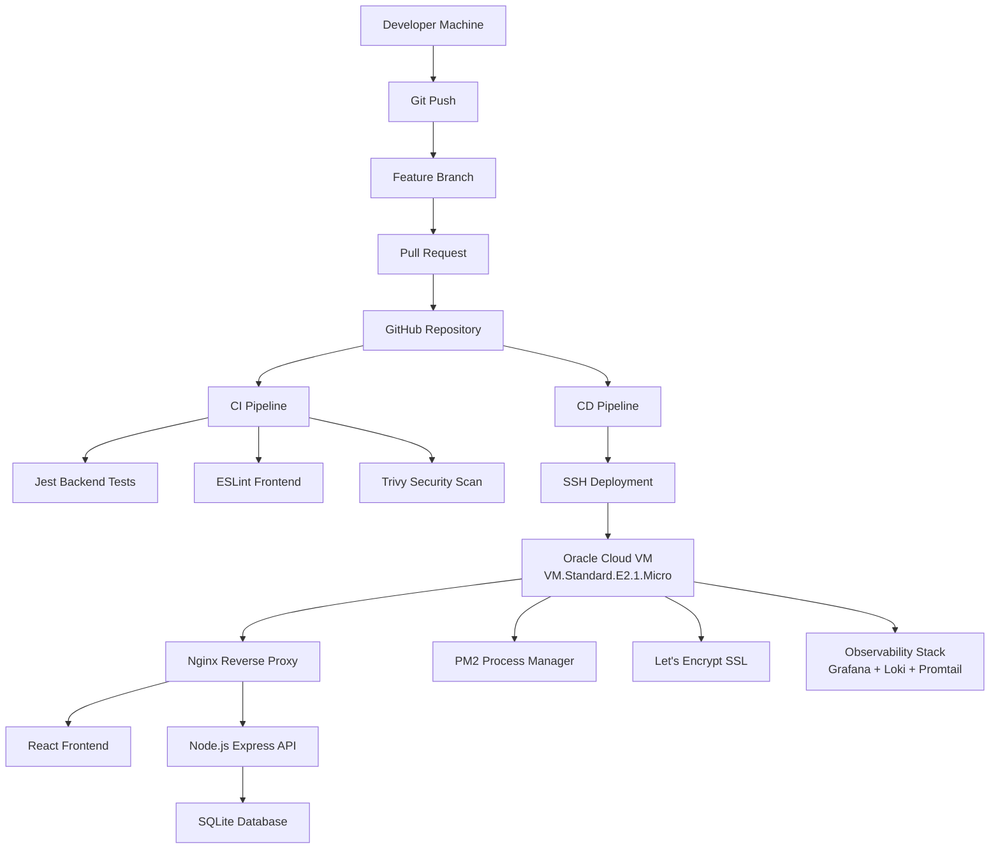
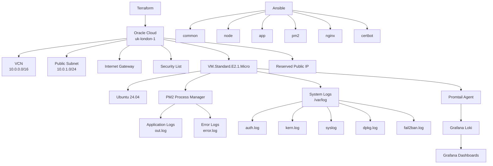
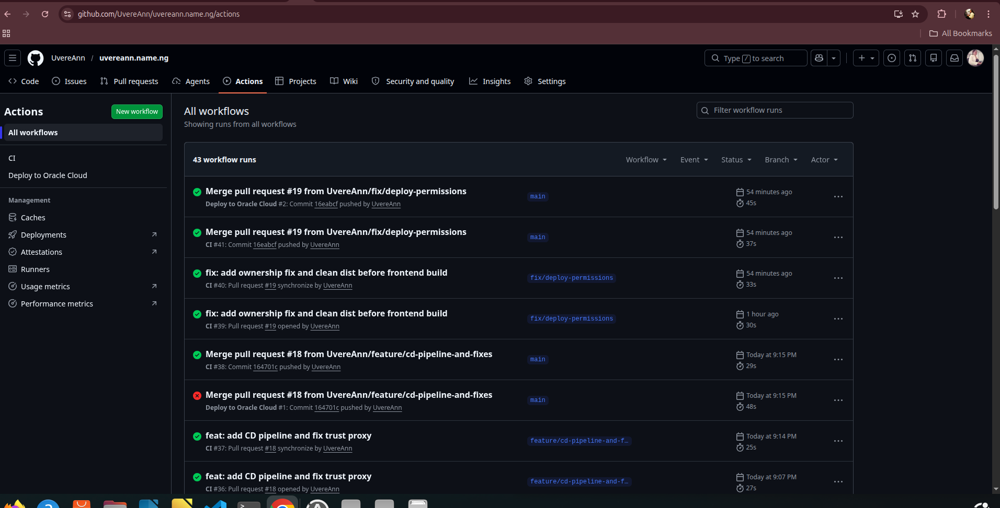
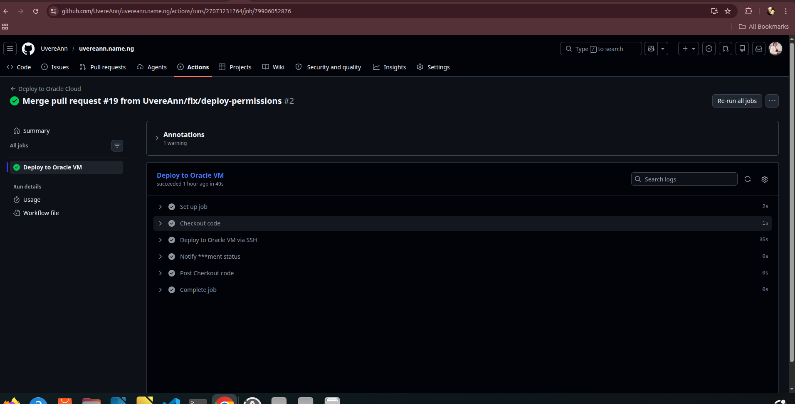
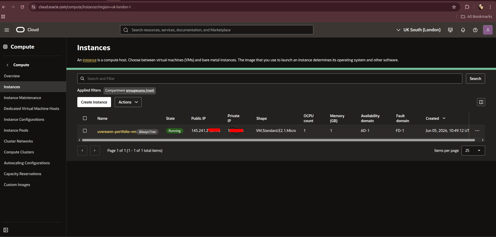
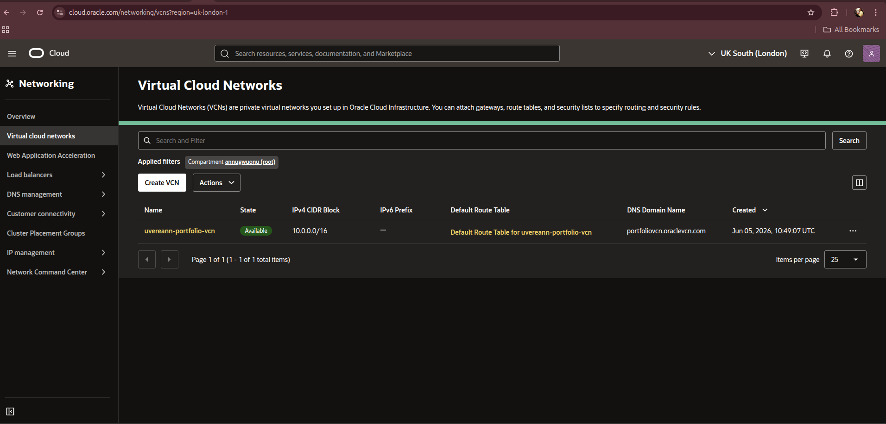
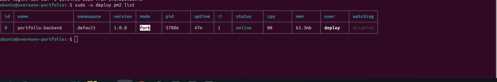

# uvereann.name.ng — DevOps Portfolio

A portfolio website that IS the DevOps project. Every tool and
practice demonstrated here is used to build and run the site itself.

**Live:** https://uvereann.name.ng

---

## Architecture



## 🏗️ Architecture

```text
Developer Machine
│
├── Git Push
│
├── Feature Branch
│
└── Pull Request
    │
    ▼
GitHub Repository
│
├── CI Pipeline
│   ├── Jest Backend Tests
│   ├── ESLint Frontend
│   └── Trivy Security Scan
│
└── CD Pipeline
    │
    └── SSH Deployment
        │
        ▼
Oracle Cloud VM
(VM.Standard.E2.1.Micro)
│
├── Nginx Reverse Proxy
│   ├── React Frontend (/)
│   └── Node.js API (/api)
│
├── Node.js / Express
│   └── SQLite Database
│
├── PM2 Process Manager
│
├── Observability Stack
│   ├── Promtail (log agent)
│   ├── Grafana Loki (log storage)
│   └── Grafana (log querying & visualization)
│
└── Let's Encrypt SSL
```

---

## Tech Stack

| Layer | Technology | Purpose |
|-------|-----------|---------|
| Frontend | React 18, Vite, TailwindCSS | UI |
| Backend | Node.js, Express | REST API |
| Database | SQLite | Data persistence |
| Process Manager | PM2 | Keep Node.js running, auto-restart |
| Reverse Proxy | Nginx | HTTPS, static files, API routing |
| SSL | Let's Encrypt (Certbot) | Free automatic HTTPS |
| IaC | Terraform | Provision OCI infrastructure |
| Configuration | Ansible | Configure and deploy to VM |
| CI/CD | GitHub Actions | Test, scan, deploy on every push |
| Security Scanning | Trivy | Dependency CVE scanning |
| Observability | Grafana, Loki, Promtail | Centralized logging & telemetry |
| Cloud | Oracle Cloud (Always Free) | Production hosting |

---

## DevOps Practices Demonstrated

- **Infrastructure as Code** — Terraform provisions VCN, subnet, firewall, VM, and reserved IP
- **Configuration as Code** — Ansible configures the entire server (Node.js, Nginx, PM2, Certbot)
- **CI/CD Pipeline** — GitHub Actions runs tests and security scan on every PR, deploys on merge to main
- **Security scanning** — Trivy scans dependencies for CVEs, blocks merge on CRITICAL findings
- **Zero-downtime deploys** — PM2 reload keeps the backend serving traffic during restarts
- **Automated HTTPS** — Certbot obtains and auto-renews Let's Encrypt certificates
- **Security hardening** — UFW firewall, non-root deploy user, rate limiting, input validation, XSS prevention
- **Observability** — Health check endpoints, PM2 process monitoring, structured request logging, Centralized logging pipeline using Promtail, Grafana Loki, and Grafana for real-time visibility into application and system behavior
- **GitOps workflow** — Branch protection, required CI checks, PR-based deployments

---

## 🔭 Observability (Logging & Telemetry)

This project includes a production-grade logging pipeline for full system visibility.

### Logging Pipeline

- **Application logs (PM2)** are written from Node.js backend (`out.log`, `error.log`)
- **System logs** are collected from `/var/log` (auth, kernel, sudo, dpkg, fail2ban)
- **Promtail agent** runs on the VM and continuously tails these logs
- Logs are shipped to **Grafana Loki** for indexing and querying

### Log Labeling

Logs are structured with labels such as:

- `job="portfolio-backend"`
- `job="varlogs"`
- `host="portfolio-vm"`

### Log Query Examples (Grafana Explore)

```logql
{job="portfolio-backend"}
{job="varlogs"} |= "error"
{job="varlogs"} |= "sudo"
```

---

## Local Development

```bash
# One-time setup
bash scripts/setup.sh

# Terminal 1 — backend
cd backend && npm run dev
# Runs on http://localhost:3000

# Terminal 2 — frontend
cd frontend && npm run dev
# Runs on http://localhost:5173
```

---

# API Endpoints

## 🔍 Health
- `GET /health` — Liveness check
- `GET /health/ready` — Readiness check (tests DB connection)

## 📁 Projects
- `GET /api/projects` — Get all projects
- `GET /api/projects/:id` — Get single project

## 📝 Blog
- `GET /api/blog` — Get all blog posts (no content — list view)
- `GET /api/blog/:slug` — Get single post with full content
- `GET /api/blog/:slug/comments` — Get approved comments for a post
- `POST /api/blog/:slug/comments` — Submit a comment (requires moderation)
- `GET /api/blog/:slug/likes` — Get like count + whether you liked it
- `POST /api/blog/:slug/like` — Toggle like (IP-based deduplication)

## 📧 Contact
- `POST /api/contact` — Contact form submission

## 🔒 Admin (Protected)
- `GET /api/admin/messages?secret=` — View contact submissions
- `GET /api/admin/comments?secret=` — Moderate blog comments
- `GET /api/admin/likes?secret=` — View like counts

---

## Infrastructure



## ☁️ Infrastructure

```text
Terraform (infra/terraform/)
│
└── Oracle Cloud (uk-london-1)
    │
    ├── VCN
    │   └── 10.0.0.0/16
    │
    ├── Public Subnet
    │   └── 10.0.1.0/24
    │
    ├── Internet Gateway
    │
    ├── Security List
    │   ├── Port 22 (SSH)
    │   ├── Port 80 (HTTP)
    │   └── Port 443 (HTTPS)
    │
    ├── VM.Standard.E2.1.Micro
    │   ├── Ubuntu 24.04
    │   ├── 1 OCPU
    │   ├── 1 GB RAM
    │   └── Always Free
    │
    ├── Observability Stack
    │   ├── PM2 Log Files (out.log, error.log)
    │   ├── System Logs (/var/log)
    │   │   ├── auth.log
    │   │   ├── syslog
    │   │   ├── kern.log
    │   │   ├── dpkg.log
    │   │   └── fail2ban.log
    │   ├── Promtail Agent (log shipper)
    │   └── Grafana Loki (log storage + querying)
    │
    └── Reserved Public IP

Ansible (infra/ansible/)
│
├── common
│   ├── System Update
│   ├── UFW Firewall
│   └── Deploy User
│
├── node
│   └── Node.js 20
│
├── app
│   ├── Clone Repository
│   ├── Configure .env
│   ├── Install Dependencies
│   └── Build Frontend
│
├── pm2
│   └── Process Manager + Logging
│
├── nginx
│   └── Reverse Proxy
│
├── certbot
│   └── Let's Encrypt SSL
│
└── observability
    ├── Promtail configuration
    ├── Log sources setup (/var/log + PM2 logs)
    └── Grafana Loki pipeline
```

---

## CI/CD Pipeline + Observability

```mermaid
flowchart TD

A[Pull Request Opened]

A --> B[Test Job]
B --> B1[npm test]
B1 --> B2[Jest 15 Tests]

A --> C[Lint Job]
C --> C1[ESLint Frontend]

A --> D[Security Scan]
D --> D1[Trivy Filesystem Scan]
D1 --> D2[Block on HIGH or CRITICAL CVEs]

D2 --> E[Merge to main]

E --> F[Deploy Job]

F --> G[SSH into Oracle VM]
G --> H[git pull origin main]
H --> I[npm ci Backend]
I --> J[npm ci && npm run build Frontend]
J --> K[pm2 reload portfolio-backend]
K --> L[curl /health]
L --> M[HTTP 200 OK]

%% Observability flow
K --> N[PM2 Logs]
N --> N1[stdout / stderr logs]

I --> O[Application Logging Layer]
O --> O1[Structured API logs]

G --> P[System Logs (/var/log)]
P --> P1[auth.log / kern.log / dpkg.log / fail2ban.log]

N1 --> Q[Promtail Agent]
O1 --> Q
P1 --> Q

Q --> R[Grafana Loki]
R --> S[Grafana Dashboards]


```

## 🚀 CI/CD Pipeline

```text
Pull Request Opened
│
├── Test Job
│   ├── npm test
│   └── Jest (15 Tests)
│
├── Lint Job
│   └── ESLint Frontend
│
├── Security Scan
│   ├── Trivy Filesystem Scan
│   └── Blocks on HIGH / CRITICAL CVEs
│
└── Merge to main
    │
    ▼
Deploy Job
│
├── SSH into Oracle VM
├── git pull origin main
├── npm ci (Backend)
├── npm ci && npm run build (Frontend)
├── pm2 reload portfolio-backend
├── curl /health
│   └── HTTP 200 OK
│
└── Observability Pipeline
    │
    ├── PM2 logs (out.log / error.log)
    ├── Node.js structured logs (API requests, errors)
    ├── System logs (/var/log)
    │   ├── auth.log
    │   ├── kern.log
    │   ├── dpkg.log
    │   └── fail2ban.log
    │
    ├── Promtail agent (log shipper)
    └── Grafana Loki (log storage + querying)
        └── Grafana Dashboards (visualization + alerting)
```

## Security

- Non-root `deploy` user runs the application
- UFW firewall — only ports 22, 80, 443 open
- Rate limiting — 100 req/15min general, 5 req/hour contact form
- Input validation and XSS sanitization on all user inputs
- Secrets in environment variables only — never in code
- Trivy CVE scanning blocks vulnerable dependencies from deploying
- HTTPS enforced — HTTP redirects to HTTPS via Nginx
- Admin endpoints protected by secret key
---

## 📸 Deployment Validation

<details>
<summary>Click to view screenshots</summary>

### GitHub Actions

All tests passing




### Oracle Cloud Console

Service status: Running





</details>